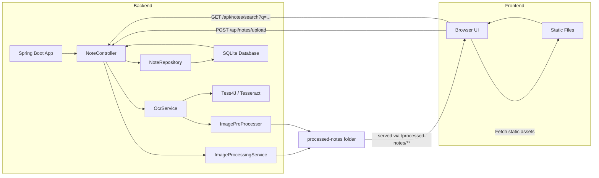
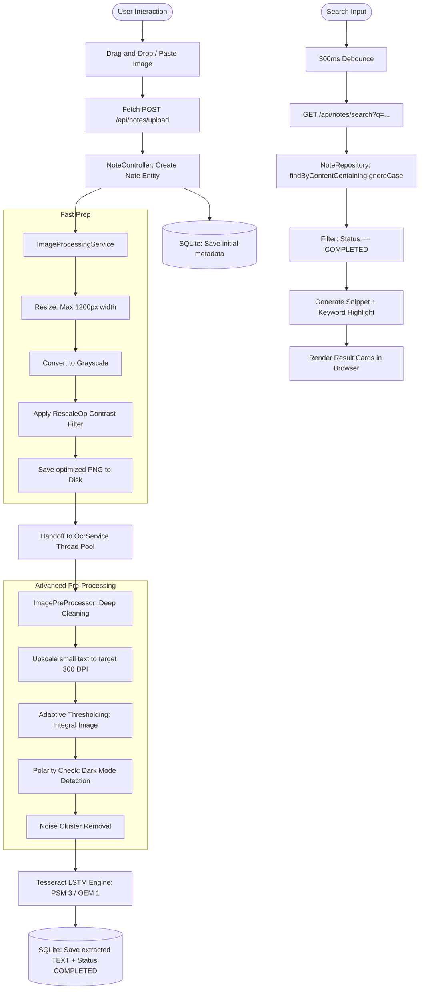

# Architecture and Flow

## Architecture Diagram

## Flowchart

## Notes

- The backend is a Spring Boot application with REST endpoints.
- Uploaded images are preprocessed and stored in `processed-notes`.
- OCR runs asynchronously in a background thread pool.
- Text search uses SQLite through Spring Data JPA.
- Static UI assets are served from `src/main/resources/static`.
